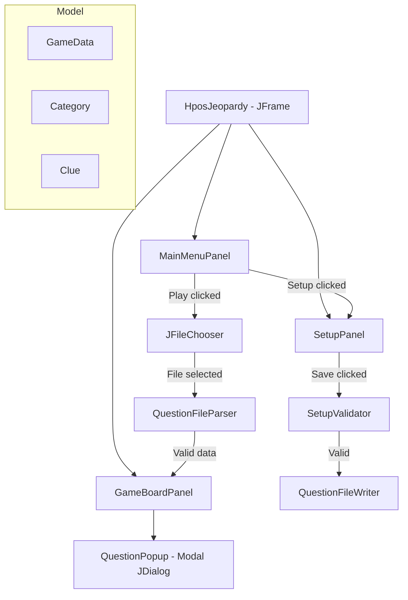
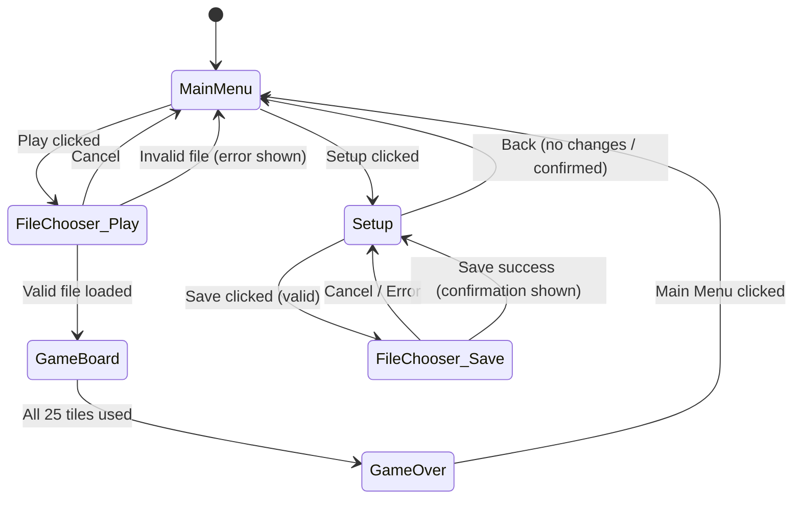
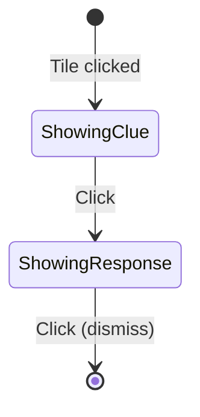

# Design Document: HPOS Jeopardy

## Overview

HPOS Jeopardy is a standalone Java Swing desktop application that replicates the Jeopardy TV quiz show. The application provides two core workflows: a Setup workflow for authoring custom question sets (persisted as tab-delimited UTF-8 text files), and a Play workflow for loading a question file and playing through the board. The UI is organized as a single-JFrame application that swaps content panels to navigate between Main Menu, Setup Screen, and Game Board screens.

The design follows the established LittleProjects conventions: a primary JFrame-based class owns the application lifecycle, with separate model classes handling data and logic. The application uses standard Swing components (JPanel, JButton, JTextField, JScrollPane, JFileChooser, JOptionPane) for the UI, and Graphics2D rendering is reserved for the Game Board tile grid.

## Architecture

The application uses a single-window, panel-swapping architecture consistent with existing projects in this repository (e.g., `games.snake.ai.Menu` swaps content panes for navigation).



### Navigation Flow



### Design Decisions

1. **Single JFrame with `setContentPane()`**: Rather than creating multiple frames or using CardLayout, the application swaps the entire content pane. This is the pattern already used by `games.snake.ai.Menu` and keeps navigation simple.

2. **Modal JDialog for Question Popup**: The popup must block interaction with the game board and enforce a click-through sequence. A modal `JDialog` achieves this without custom modality logic.

3. **Model-View separation**: Data classes (`GameData`, `Category`, `Clue`) are plain POJOs with no Swing dependencies. Serialization/parsing operates on models only. This allows the file format logic to be tested independently of the UI.

4. **No game loop Timer**: Unlike the snake games, Jeopardy has no continuous animation. All interactions are event-driven (button clicks, mouse clicks on tiles). No `javax.swing.Timer` is needed.

## Components and Interfaces

### Entry Point

**`HposJeopardy`** (extends `JFrame`)
- Application entry point with `main` method
- Manages window setup (800×600, centered, title, EXIT_ON_CLOSE)
- Provides navigation methods that swap content panes:
  - `showMainMenu()`
  - `showSetup()`
  - `showGameBoard(GameData data)`

### UI Panels

**`MainMenuPanel`** (extends `JPanel`)
- Displays "Play" and "Setup" buttons
- "Play" → opens JFileChooser, delegates to `QuestionFileParser`, calls `showGameBoard()`
- "Setup" → calls `showSetup()`

**`SetupPanel`** (extends `JPanel`)
- Contains a `JScrollPane` wrapping a form with:
  - 5 category name fields (JTextField, max 50 chars)
  - 25 clue groups (each: clue JTextField max 300 chars, response JTextField max 150 chars, image path JTextField)
- "Save" button → validates via `SetupValidator`, writes via `QuestionFileWriter`
- "Back" button → checks dirty state, shows confirmation if modified, navigates to Main Menu
- Tracks dirty state via `DocumentListener` on all text fields

**`GameBoardPanel`** (extends `JPanel`)
- Renders a 5×5 grid of tile buttons below a row of category labels
- Manages tile state (available vs used)
- On tile click → opens `QuestionPopup`
- On popup dismiss → marks tile as used, checks for game completion
- On game complete → overlays game-over message with "Main Menu" button

**`QuestionPopup`** (extends `JDialog`)
- Modal, undecorated dialog covering the game board area
- State machine: SHOWING_CLUE → SHOWING_RESPONSE → DISMISSED
- Click advances state; no keyboard or outside-click dismissal
- Displays image (scaled, aspect-ratio preserved) above clue text when available
- Displays response text on second click

### Model Classes

**`GameData`**
- Contains: `List<Category> categories` (exactly 5)
- Factory method: `GameData.fromFile(File)` delegates to parser
- Method: `void toFile(File)` delegates to writer

**`Category`**
- Contains: `String name`, `List<Clue> clues` (exactly 5, ordered by point value)

**`Clue`**
- Contains: `int pointValue`, `String clueText`, `String responseText`, `String imagePath` (empty string if none)

### Service Classes

**`SetupValidator`**
- Method: `List<String> validate(GameData data)`
- Returns empty list if valid; otherwise returns list of error messages identifying each empty/whitespace field and any fields containing tab or newline characters
- Checks all categories, clues, responses; allows empty image paths

**`QuestionFileParser`**
- Method: `GameData parse(File file) throws ParseException`
- Reads UTF-8 line-based format, validates structure (5 categories × (1 name line + 5 clue lines))
- Throws `ParseException` with descriptive message on format errors

**`QuestionFileWriter`**
- Method: `void write(GameData data, File file) throws IOException`
- Writes UTF-8 tab-delimited format per Requirement 7

## Data Models

### GameData Structure

```
GameData
├── categories: List<Category> [size = 5]
│   ├── Category
│   │   ├── name: String (1-50 chars, no tabs/newlines)
│   │   └── clues: List<Clue> [size = 5]
│   │       ├── Clue { pointValue: 100, clueText, responseText, imagePath }
│   │       ├── Clue { pointValue: 200, clueText, responseText, imagePath }
│   │       ├── Clue { pointValue: 300, clueText, responseText, imagePath }
│   │       ├── Clue { pointValue: 500, clueText, responseText, imagePath }
│   │       └── Clue { pointValue: 1000, clueText, responseText, imagePath }
```

### Question File Format (on disk)

```
<Category1Name>\n
<100>\t<ClueText>\t<ResponseText>\t<ImagePath>\n
<200>\t<ClueText>\t<ResponseText>\t<ImagePath>\n
<300>\t<ClueText>\t<ResponseText>\t<ImagePath>\n
<500>\t<ClueText>\t<ResponseText>\t<ImagePath>\n
<1000>\t<ClueText>\t<ResponseText>\t<ImagePath>\n
<Category2Name>\n
...
```

- Encoding: UTF-8
- Field delimiter: single tab character (`\t`)
- Record separator: newline (`\n`)
- 5 category blocks, each block = 1 name line + 5 clue lines = 6 lines
- Total: 30 lines per file
- Image path is empty string `""` when no image is associated

### Tile State Model

Each tile on the game board has a simple binary state:

| State | Visual | Clickable |
|-------|--------|-----------|
| AVAILABLE | Shows point value, default color | Yes |
| USED | No text, changed background color | No (click ignored) |

### Question Popup State Machine



## Correctness Properties

*A property is a characteristic or behavior that should hold true across all valid executions of a system — essentially, a formal statement about what the system should do. Properties serve as the bridge between human-readable specifications and machine-verifiable correctness guarantees.*

### Property 1: Serialization Round-Trip

*For any* valid GameData object (5 categories, each with a name and 5 clues containing point value, clue text, response text, and image path — none containing tab or newline characters), serializing it to a file using `QuestionFileWriter` and then parsing that file using `QuestionFileParser` SHALL produce a GameData object where every category name, clue text, response text, point value, and image path matches the original field-by-field in the same order.

**Validates: Requirements 4.2, 6.2, 7.1, 7.2, 7.3**

### Property 2: Validation Completeness

*For any* GameData object where N fields (category names, clue texts, or response texts) are empty or contain only whitespace characters, the `SetupValidator` SHALL return exactly N error messages, each correctly identifying the position and type of the invalid field. Image path fields that are empty SHALL NOT be counted as errors.

**Validates: Requirements 5.1, 5.2, 5.3, 5.4, 5.5**

### Property 3: Disallowed Character Rejection

*For any* GameData object where at least one category name, clue text, or response text contains a tab character (`\t`) or newline character (`\n`), the `SetupValidator` SHALL reject the input with a validation error identifying which field contains the disallowed character.

**Validates: Requirements 7.4**

### Property 4: Category Name Truncation

*For any* string, the category display function SHALL return the original string unchanged if its length is 20 characters or fewer, and SHALL return the first 20 characters followed by an ellipsis (`...`) if its length exceeds 20 characters.

**Validates: Requirements 8.1**

### Property 5: Tile State Persistence

*For any* sequence of tile selections on a game board, after each selection is completed (popup dismissed), every previously selected tile SHALL be in the USED state and SHALL remain in the USED state for all subsequent operations within the same game session.

**Validates: Requirements 10.1, 10.4**

### Property 6: Used Tile Click Is No-Op

*For any* tile in the USED state, clicking that tile SHALL NOT open a Question Popup, SHALL NOT change any tile states, and SHALL NOT modify any other game state.

**Validates: Requirements 10.3**

### Property 7: Image Scaling Preserves Aspect Ratio

*For any* image with width W and height H, and *for any* popup bounds (maxWidth, maxHeight) where both are positive, the scaled dimensions SHALL satisfy: (1) scaledWidth ≤ maxWidth, (2) scaledHeight ≤ maxHeight, and (3) the aspect ratio scaledWidth/scaledHeight equals W/H within floating-point tolerance.

**Validates: Requirements 12.3**

## Error Handling

### File I/O Errors (Save)

- When `QuestionFileWriter.write()` throws an `IOException`, the SetupPanel catches it, displays a `JOptionPane.showMessageDialog` error dialog with the exception message, and returns the user to the Setup Screen with all form data preserved (no data is cleared).

### File I/O Errors (Load)

- When `QuestionFileParser.parse()` throws a `ParseException` (file doesn't conform to expected format), the MainMenuPanel displays a `JOptionPane.showMessageDialog` error dialog explaining the file is invalid, and returns to the Main Menu.
- When the file is empty (0 bytes), the parser throws `ParseException` with a message indicating the file is empty.

### Image Loading Errors

- When `ImageIO.read()` returns null or throws an exception for a clue's image path, the QuestionPopup proceeds without an image, displaying only the clue text. No error dialog is shown — this is a graceful degradation.

### Validation Errors

- When `SetupValidator.validate()` returns a non-empty error list, the SetupPanel displays all errors in a single `JOptionPane.showMessageDialog` (one error per line), and the save operation is aborted. The user remains on the Setup Screen with all data preserved.

### Unsaved Changes Warning

- When the user clicks "Back" on the Setup Screen with unsaved modifications (tracked via DocumentListeners on all text fields), a `JOptionPane.showConfirmDialog` asks "You have unsaved changes. Are you sure you want to leave?" with Yes/No options. "Yes" navigates to Main Menu; "No" returns to Setup Screen.

## Testing Strategy

### Property-Based Testing

Since no test framework exists in this project, property-based tests will use a lightweight approach with JUnit 4 (added to the classpath for testing only) and a custom simple random generator utility, OR tests can be run as a standalone test harness with `main` methods that exercise properties with random inputs.

**Library choice**: Given the Java 8 / Eclipse JDT / no-Maven constraint, the simplest approach is a standalone test class with a `main` method that uses `java.util.Random` to generate inputs and runs each property 100+ times, printing PASS/FAIL results. This avoids adding external dependencies.

**Configuration**:
- Minimum 100 iterations per property
- Each property test tagged with: `// Feature: hpos-jeopardy, Property N: <property text>`
- Random seed printed on failure for reproducibility

### Property Tests

| Property | What's Generated | What's Verified |
|----------|-----------------|-----------------|
| 1: Serialization Round-Trip | Random GameData (valid category names, clue texts, responses, image paths — no tabs/newlines) | `parse(write(data)) == data` |
| 2: Validation Completeness | Random GameData with random subset of fields set to whitespace-only | Error count == number of whitespace fields |
| 3: Disallowed Character Rejection | Random strings with embedded `\t` or `\n` in random fields | Validator rejects with correct field identification |
| 4: Category Name Truncation | Random strings of length 0–100 | Truncation rule applied correctly |
| 5: Tile State Persistence | Random permutation of tile selection order | All selected tiles remain USED after each step |
| 6: Used Tile Click No-Op | Random board state with some tiles USED, click random USED tile | No state change |
| 7: Image Scaling | Random (width, height, maxWidth, maxHeight) tuples | Fits bounds + preserves aspect ratio |

### Unit Tests (Example-Based)

- Main Menu: both buttons present, Play opens file chooser, Setup navigates to setup screen
- Setup Screen: correct number of text fields, character limits enforced, scroll pane present
- Question Popup state machine: click-through sequence (Clue → Response → dismiss)
- Game completion: 25th tile triggers game-over message
- Error cases: empty file parsed, malformed file parsed, I/O error on save

### Integration Tests

- End-to-end: create data in Setup Screen → save to file → load via Play → verify Game Board shows correct categories and clues
- Image loading: valid image file loads and displays; missing image file degrades gracefully

